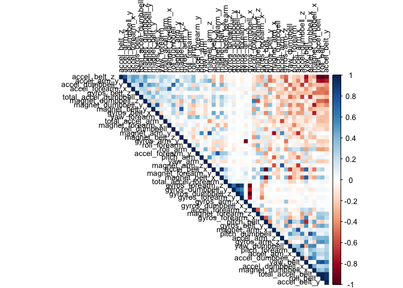
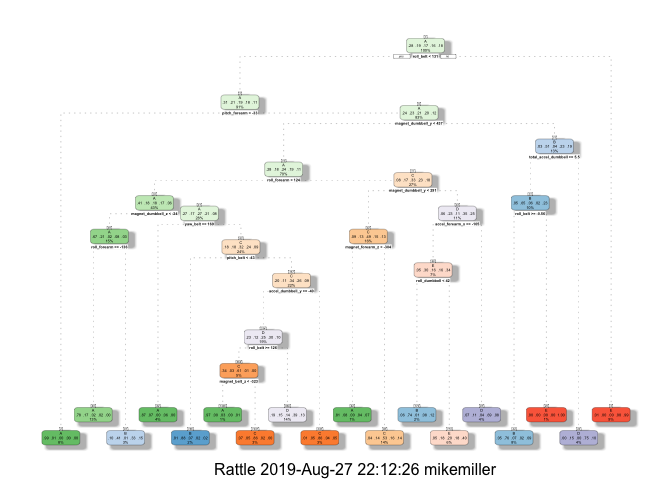
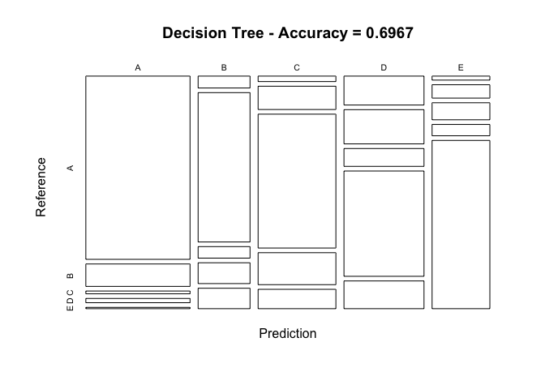
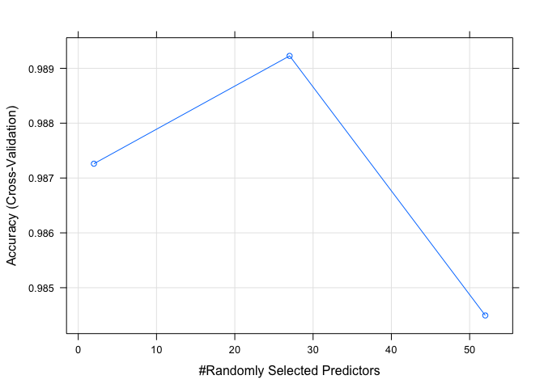
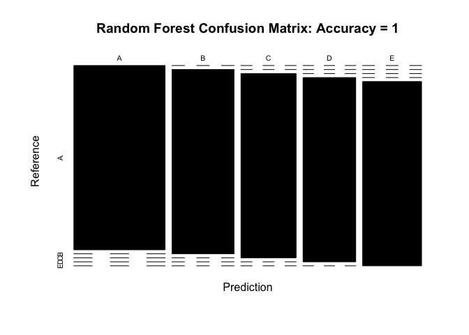

## Overview
Using devices such as Jawbone Up, Nike FuelBand, and Fitbit it is now possible to collect a large amount of data about personal activity relatively inexpensively. These type of devices are part of the quantified self movement - a group of enthusiasts who take measurements about themselves regularly to improve their health, to find patterns in their behavior, or because they are tech geeks. One thing that people regularly do is quantify how much of a particular activity they do, but they rarely quantify how well they do it.

In this project, we will use data from accelerometers on the belt, forearm, arm, and dumbell of 6 participants. They were asked to perform barbell lifts correctly and incorrectly in 5 different ways.

The data consists of a Training data and a Test data (to be used to validate the selected model).

The goal of your project is to predict the manner in which they did the exercise. This is the “classe” variable in the training set. You may use any of the other variables to predict with.

## Loading Data and Processing 

```r
library(caret)
library(rpart)
library(rpart.plot)
library(rattle)
library(randomForest)
library(corrplot)
library(gbm)
```

### Exploring Data


```r
train_in <- read.csv('/Users/mikemiller/Downloads/pml-training.csv', header=T)
valid_in <- read.csv('/Users/mikemiller/Downloads/pml-testing.csv', header=T)
dim(train_in)
```

```
## [1] 19622   160
```

```r
dim(valid_in)
```

```
## [1]  20 160
```

## Removing Variables that contain missing values


```r
trainData<- train_in[, colSums(is.na(train_in)) == 0]
validData <- valid_in[, colSums(is.na(valid_in)) == 0]
dim(trainData)
```

```
## [1] 19622    93
```

```r
dim(validData)
```

```
## [1] 20 60
```


## Removing first 7 variables due to little impact on the outcome classe


```r
trainData <- trainData[, -c(1:7)]
validData <- validData[, -c(1:7)]
dim(trainData)
```

```
## [1] 19622    86
```

```r
dim(validData)
```

```
## [1] 20 53
```

## Preparing the datasets for prediction

Preparing the data for prediction by splitting the training data into 70% as train data and 30% as test data. This splitting will server also to compute the out-of-sample errors.

The test data renamed: valid_in (validate data) will stay as is and will be used later to test the prodction algorithm on the 20 cases.


```r
set.seed(1234) 
inTrain <- createDataPartition(trainData$classe, p = 0.7, list = FALSE)
trainData <- trainData[inTrain, ]
testData <- trainData[-inTrain, ]
dim(trainData)
```

```
## [1] 13737    86
```

```r
dim(testData)
```

```
## [1] 4124   86
```

## Removing variables that are near-zero-variance

```r
NZV <- nearZeroVar(trainData)
trainData <- trainData[, -NZV]
testData  <- testData[, -NZV]
dim(trainData)
```

```
## [1] 13737    53
```

```r
dim(testData)
```

```
## [1] 4124   53
```

After this cleaning we are down now to 53 variables

The following correlation plot uses the following parameters (source:CRAN Package ‘corrplot’) “FPC”: the first principal component order. “AOE”: the angular order tl.cex Numeric, for the size of text label (variable names) tl.col The color of text label.


```r
cor_mat <- cor(trainData[, -53])
corrplot(cor_mat, order = "FPC", method = "color", type = "upper", 
         tl.cex = 0.8, tl.col = rgb(0, 0, 0))
```

<!-- -->

In the corrplot graph the correlated predictors (variables ) are those with a dark color intersection.

To obtain the names of the variables we do the following

we use the findCorrelation function to search for highly correlated attributes with a cut off equal to 0.75


```r
highlyCorrelated = findCorrelation(cor_mat, cutoff=0.75)
```

We then obtain the names of highly correlated attributes


```r
names(trainData)[highlyCorrelated]
```

```
##  [1] "accel_belt_z"      "roll_belt"         "accel_belt_y"     
##  [4] "total_accel_belt"  "accel_dumbbell_z"  "accel_belt_x"     
##  [7] "pitch_belt"        "magnet_dumbbell_x" "accel_dumbbell_y" 
## [10] "magnet_dumbbell_y" "accel_arm_x"       "accel_dumbbell_x" 
## [13] "accel_arm_z"       "magnet_arm_y"      "magnet_belt_z"    
## [16] "accel_forearm_y"   "gyros_forearm_y"   "gyros_dumbbell_x" 
## [19] "gyros_dumbbell_z"  "gyros_arm_x"
```

## Model building

For this project we will use two different algorithms, classification trees and random forests, to predict the outcome.

1. Classification Trees
2. Random Forests
3. Generalized Boosted Model

## Prediction with classification trees

We first obtail the model, and then we use the fancyRpartPlot() function to plot the classification tree as a dendogram.


```r
set.seed(12345)
decisionTreeMod1 <- rpart(classe ~ ., data=trainData, method="class")
fancyRpartPlot(decisionTreeMod1)
```

<!-- -->

We then validate the model “decisionTreeModel” on the testData to find out how well it performs by looking at the accuracy variable.


```r
predictTreeMod1 <- predict(decisionTreeMod1, testData, type = "class")
cmtree <- confusionMatrix(predictTreeMod1, testData$classe)
cmtree
```

```
## Confusion Matrix and Statistics
## 
##           Reference
## Prediction   A   B   C   D   E
##          A 990 121  15  23   7
##          B  32 402  31  56  55
##          C  22  94 540 129  78
##          D 120 142  74 437 115
##          E  12  40  51  34 504
## 
## Overall Statistics
##                                           
##                Accuracy : 0.6967          
##                  95% CI : (0.6824, 0.7107)
##     No Information Rate : 0.2852          
##     P-Value [Acc > NIR] : < 2.2e-16       
##                                           
##                   Kappa : 0.6174          
##                                           
##  Mcnemar's Test P-Value : < 2.2e-16       
## 
## Statistics by Class:
## 
##                      Class: A Class: B Class: C Class: D Class: E
## Sensitivity            0.8418  0.50313   0.7595   0.6436   0.6640
## Specificity            0.9437  0.94767   0.9054   0.8691   0.9593
## Pos Pred Value         0.8564  0.69792   0.6257   0.4921   0.7863
## Neg Pred Value         0.9373  0.88811   0.9476   0.9252   0.9268
## Prevalence             0.2852  0.19374   0.1724   0.1646   0.1840
## Detection Rate         0.2401  0.09748   0.1309   0.1060   0.1222
## Detection Prevalence   0.2803  0.13967   0.2093   0.2153   0.1554
## Balanced Accuracy      0.8928  0.72540   0.8324   0.7563   0.8117
```

## Plot Matrix Results


```r
plot(cmtree$table, col = cmtree$byClass, 
     main = paste("Decision Tree - Accuracy =", round(cmtree$overall['Accuracy'], 4)))
```

<!-- -->

We see that the accuracy rate of the model is low: 0.6967 and therefore the out-of-sample-error is about 0.3 which is considerable.

## Prediction with Random Forest


```r
controlRF <- trainControl(method="cv", number=3, verboseIter=FALSE)
modRF1 <- train(classe ~ ., data=trainData, method="rf", trControl=controlRF)
modRF1$finalModel
```

```
## 
## Call:
##  randomForest(x = x, y = y, mtry = param$mtry) 
##                Type of random forest: classification
##                      Number of trees: 500
## No. of variables tried at each split: 27
## 
##         OOB estimate of  error rate: 0.61%
## Confusion matrix:
##      A    B    C    D    E class.error
## A 3902    3    0    0    1 0.001024066
## B   19 2633    6    0    0 0.009405568
## C    0   11 2380    5    0 0.006677796
## D    0    0   25 2225    2 0.011989343
## E    0    0    4    8 2513 0.004752475
```

We then validate the model obtained model *“modRF1”* on the test data to find out how well it performs by looking at the Accuracy variable


```r
predictRF1 <- predict(modRF1, newdata=testData)
cmrf <- confusionMatrix(predictRF1, testData$classe)
cmrf
```

```
## Confusion Matrix and Statistics
## 
##           Reference
## Prediction    A    B    C    D    E
##          A 1176    0    0    0    0
##          B    0  799    0    0    0
##          C    0    0  711    0    0
##          D    0    0    0  679    0
##          E    0    0    0    0  759
## 
## Overall Statistics
##                                      
##                Accuracy : 1          
##                  95% CI : (0.9991, 1)
##     No Information Rate : 0.2852     
##     P-Value [Acc > NIR] : < 2.2e-16  
##                                      
##                   Kappa : 1          
##                                      
##  Mcnemar's Test P-Value : NA         
## 
## Statistics by Class:
## 
##                      Class: A Class: B Class: C Class: D Class: E
## Sensitivity            1.0000   1.0000   1.0000   1.0000    1.000
## Specificity            1.0000   1.0000   1.0000   1.0000    1.000
## Pos Pred Value         1.0000   1.0000   1.0000   1.0000    1.000
## Neg Pred Value         1.0000   1.0000   1.0000   1.0000    1.000
## Prevalence             0.2852   0.1937   0.1724   0.1646    0.184
## Detection Rate         0.2852   0.1937   0.1724   0.1646    0.184
## Detection Prevalence   0.2852   0.1937   0.1724   0.1646    0.184
## Balanced Accuracy      1.0000   1.0000   1.0000   1.0000    1.000
```

 The accuracy rate using the random forest is very high: Accuracy : 1 and therefore the out-of-sample-error is equal to 0***. But it might be due to overfitting.


```r
plot(modRF1)
```

<!-- -->


```r
plot(cmrf$table, col = cmrf$byClass, main = paste("Random Forest Confusion Matrix: Accuracy =", round(cmrf$overall['Accuracy'], 4)))
```

<!-- -->


## Prediction with Generalized Boosted Regression Models


```r
set.seed(12345)
controlGBM <- trainControl(method = "repeatedcv", number = 5, repeats = 1)
modGBM  <- train(classe ~ ., data=trainData, method = "gbm", trControl = controlGBM, verbose = FALSE)
modGBM$finalModel
```

```
## A gradient boosted model with multinomial loss function.
## 150 iterations were performed.
## There were 52 predictors of which 52 had non-zero influence.
```


```r
print(modGBM)
```

```
## Stochastic Gradient Boosting 
## 
## 13737 samples
##    52 predictor
##     5 classes: 'A', 'B', 'C', 'D', 'E' 
## 
## No pre-processing
## Resampling: Cross-Validated (5 fold, repeated 1 times) 
## Summary of sample sizes: 10990, 10991, 10989, 10990, 10988 
## Resampling results across tuning parameters:
## 
##   interaction.depth  n.trees  Accuracy   Kappa    
##   1                   50      0.7510370  0.6845815
##   1                  100      0.8171350  0.7686429
##   1                  150      0.8533135  0.8144335
##   2                   50      0.8520032  0.8125199
##   2                  100      0.9071828  0.8825490
##   2                  150      0.9318612  0.9137796
##   3                   50      0.8950994  0.8671743
##   3                  100      0.9414709  0.9259338
##   3                  150      0.9609802  0.9506365
## 
## Tuning parameter 'shrinkage' was held constant at a value of 0.1
## 
## Tuning parameter 'n.minobsinnode' was held constant at a value of 10
## Accuracy was used to select the optimal model using the largest value.
## The final values used for the model were n.trees = 150,
##  interaction.depth = 3, shrinkage = 0.1 and n.minobsinnode = 10.
```

## GBM Model


```r
predictGBM <- predict(modGBM, newdata=testData)
cmGBM <- confusionMatrix(predictGBM, testData$classe)
cmGBM
```

```
## Confusion Matrix and Statistics
## 
##           Reference
## Prediction    A    B    C    D    E
##          A 1167   23    0    0    1
##          B    6  765   14    0    8
##          C    2   11  688   19    3
##          D    1    0    8  657    9
##          E    0    0    1    3  738
## 
## Overall Statistics
##                                           
##                Accuracy : 0.9736          
##                  95% CI : (0.9682, 0.9782)
##     No Information Rate : 0.2852          
##     P-Value [Acc > NIR] : < 2.2e-16       
##                                           
##                   Kappa : 0.9665          
##                                           
##  Mcnemar's Test P-Value : NA              
## 
## Statistics by Class:
## 
##                      Class: A Class: B Class: C Class: D Class: E
## Sensitivity            0.9923   0.9574   0.9677   0.9676   0.9723
## Specificity            0.9919   0.9916   0.9897   0.9948   0.9988
## Pos Pred Value         0.9798   0.9647   0.9516   0.9733   0.9946
## Neg Pred Value         0.9969   0.9898   0.9932   0.9936   0.9938
## Prevalence             0.2852   0.1937   0.1724   0.1646   0.1840
## Detection Rate         0.2830   0.1855   0.1668   0.1593   0.1790
## Detection Prevalence   0.2888   0.1923   0.1753   0.1637   0.1799
## Balanced Accuracy      0.9921   0.9745   0.9787   0.9812   0.9856
```

The accuracy rate using the random forest is very high: Accuracy : 0.9736 and therefore the **out-of-sample-error is equal to 0.0264**.

## Best Model to the Validation Data

By comparing the accuracy rate values of the three models, it is clear the the ‘Random Forest’ model is the winner. So will use it on the validation data


```r
Results <- predict(modRF1, newdata=validData)
Results
```

```
##  [1] B A B A A E D B A A B C B A E E A B B B
## Levels: A B C D E
```

